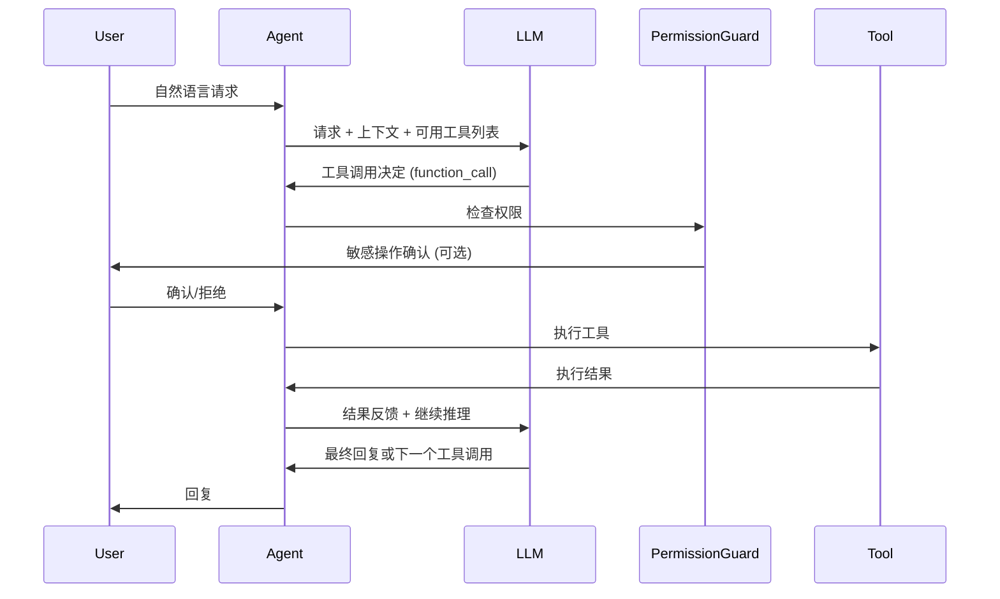

# 项目企划书：AI-Coding 终端助手

> 版本：v1.1  
> 日期：2026-06-26  
> 状态：Phase 1 完成 / Phase 2 进行中

---

## 0. 当前实现状态

### Phase 1 MVP — ✅ 已完成

| 功能 | 状态 | 实现文件 |
|------|------|----------|
| 多轮对话 | ✅ | `src/agent/index.ts` — CodingAgent (ChatOpenAI + tool-calling loop) |
| 项目读取 | ✅ | `src/tools/search/tools.ts` (grep/glob), `src/agent/context.ts` (项目上下文构建) |
| 文件写入 | ✅ | `src/tools/file/tools.ts` — createWriteTool |
| 文件编辑 | ✅ | `src/tools/file/tools.ts` — createEditTool (行级替换) |
| Shell 执行 | ✅ | `src/tools/shell/tools.ts` — bash + bash_interactive (Bun/Node.js 双实现) |
| OpenAI 兼容 API | ✅ | `src/llm/factory.ts` — ChatOpenAI，支持任意兼容 API |
| 上下文管理 | ✅ | `src/agent/context.ts` + `src/agent/system.ts` — 项目上下文 + System Prompt |
| 对话历史 | ✅ | `src/storage/session.ts` — JSON 文件持久化 + 会话恢复 |
| 工具调用系统 | ✅ | `src/tools/registry.ts` + `src/tools/guard.ts` — 工具注册表 + 权限守卫 |

### Phase 2 增强 — 🚧 部分完成

| 功能 | 状态 | 说明 |
|------|------|------|
| Config 系统 | ✅ | `src/config/` — 用户级/项目级/环境变量/CLI 四层配置 |
| 确认/审批机制 | ✅ | `src/tools/guard.ts` + `--yes` 标志 |
| 自动上下文压缩 | ✅ | `/compact [N]` 命令 (context-commands.ts) |
| 记忆/指令系统 | ✅ | 会话持久化 + 上下文状态命令 (`/status`, `/context`) |
| Node.js 兼容 | ✅ | `tsconfig.node.json` + tsx + os-compat 抽象层 |
| 二进制打包 | ✅ | `scripts/build-binary.ts` — Bun + Node.js SEA 双平台 |
| 输入框 UI | ✅ | `src/renderer/input.ts` — ASCII 终端输入渲染 |
| 文件引用 | ✅ | `src/cli/file-refs.ts` — @file 语法 + 内容注入 |
| 上下文命令 | ✅ | `src/cli/context-commands.ts` — /status /context /compact |
| 文件差异对比 | ❌ | Phase 2 待实现 |
| 批量文件编辑 | ❌ | Phase 2 待实现 |
| Git 集成 | ❌ | Phase 2 待实现 |

### Phase 3 扩展 — ⏳ 未开始

| 功能 | 状态 |
|------|------|
| 子代理系统 | ⏳ |
| MCP 集成 | ⏳ (mcp-code-review-tool 已独立实现) |
| 插件系统 | ⏳ |
| LSP 诊断 | ⏳ |
| Checkpointing | ⏳ |
| Headless/CI 模式 | ⏳ |

### 当前架构总览

```
ai-code/src/
├── cli/
│   ├── index.ts              # 主入口 (双运行时)
│   ├── commands.ts           # CLI 参数解析 (commander)
│   ├── context-commands.ts   # /status /context /compact /clear
│   └── file-refs.ts          # @file 引用解析与注入
├── agent/
│   ├── index.ts              # CodingAgent (ChatOpenAI + tool-calling loop)
│   ├── system.ts             # System Prompt 构建
│   └── context.ts            # 项目上下文构建
├── tools/
│   ├── registry.ts           # 工具注册表
│   ├── guard.ts              # 权限守卫
│   ├── file/tools.ts         # read / write / edit
│   ├── shell/tools.ts        # bash / bash_interactive
│   └── search/tools.ts       # grep / glob
├── llm/
│   └── factory.ts            # ChatOpenAI 工厂
├── renderer/
│   ├── markdown.ts           # Markdown 终端渲染 (ASCII-only)
│   ├── spinner.ts            # 加载动画
│   └── input.ts              # 输入框 UI 渲染
├── config/
│   ├── loader.ts             # 配置加载 (四层)
│   └── schema.ts             # Zod Schema
├── storage/
│   └── session.ts            # 会话持久化
├── utils/
│   ├── logger.ts             # 结构化日志
│   └── os-compat.ts          # Bun/Node.js 兼容层
└── scripts/
    └── build-binary.ts       # 双平台二进制打包
```

---

## 1. 竞品分析

### 1.1 OpenCode

| 维度 | 详情 |
|------|------|
| **开发语言** | Go (Bubble Tea TUI 框架) |
| **许可证** | MIT 开源 |
| **核心定位** | 终端 AI 编程代理，强调简洁高效 |
| **主要特性** | 20+ 工具、LSP 集成、Client/Server 架构、技能系统、MCP 支持、多种 AI 提供商 |
| **UI 风格** | Bubble Tea TUI，支持主题定制 |
| **优势** | 开源、提供商无关、LSP 实时诊断、架构灵活、支持本地模型 |
| **不足** | 社区驱动、缺少商业支持、生态不如 Claude Code 丰富 |

### 1.2 Claude Code

| 维度 | 详情 |
|------|------|
| **开发语言** | TypeScript (内部重写频繁) |
| **许可证** | 闭源 (Anthropic) |
| **核心定位** | 终端 Agent 式编码助手，Anthropic 官方产品 |
| **主要特性** | 三层架构（核心/子代理/扩展）、CLAUDE.md 记忆系统、插件系统、MCP、Hooks、Checkpointing、子代理并行 |
| **UI 风格** | 纯终端 Markdown 渲染，权限系统完善 |
| **优势** | 200K token 上下文、子代理并行、CLAUDE.md 等级制记忆、企业级权限管控、插件生态 |
| **不足** | 仅支持 Anthropic 模型、闭源、费用较高 |

### 1.3 Codex (OpenAI)

| 维度 | 详情 |
|------|------|
| **开发语言** | Rust (Apache 2.0 开源) |
| **许可证** | Apache 2.0 |
| **核心定位** | AI 原生终端编码代理，OpenAI 旗舰产品 |
| **主要特性** | GPT-5-Codex 专用模型、多模型支持、自适应推理等级、MCP 支持、多模态输入、Codex Cloud |
| **UI 风格** | 纯终端交互，支持 Transcript 模式 |
| **优势** | 专用模型优化、OS 级沙箱（Seatbelt/seccomp）、CI 模式、云端执行、多模态 |
| **不足** | GPT-5-Codex 模型需 OpenAI 订阅、依赖 OpenAI 生态 |

### 1.4 竞品对比总结

| 维度 | OpenCode | Claude Code | Codex (OpenAI) |
|------|----------|-------------|----------------|
| 语言 | Go | TypeScript | Rust |
| 开源 | MIT | 闭源 | Apache 2.0 |
| AI 框架 | 无 (直接 API 调用) | 无 (直接 API 调用) | 无 (模型内置) |
| TUI 框架 | Bubble Tea | 自研终端渲染 ink | 自研终端渲染 |
| LSP 集成 | 原生支持 | 有限 | 有限 |
| 子代理 | 有限 | 强大 (10 并行) | 支持 |
| MCP | 支持 | 支持 | 支持 |
| 记忆系统 | 技能目录 | CLAUDE.md 等级制 | codex.md |
| 提供商 | 多提供商 | Anthropic 独占 | OpenAI + 多模型 |
| 沙箱 | 有限 | 权限系统 | OS 级沙箱 |

### 1.5 市场机会

- **LangChain 生态空白**: 现有竞品均未基于 LangChain 框架构建，缺少利用 LangChain 工具链和 Agent 系统的产品
- **TypeScript 全栈**: 面向 TypeScript 开发者的原生 AI 助手，与 Bun/Node 生态深度集成
- **模块化/可扩展**: 借鉴各竞品优点，设计更清晰的模块化和可扩展架构
- **提供商无关**: 内置 OpenAI 兼容 API 标准，天然支持多种 LLM 提供商

---

## 2. 产品定位与目标

### 2.1 产品名称

> **暂定: `ai-code`** (基于 LangChain 的终端 AI 编码助手)

### 2.2 核心价值主张

> **"面向 TypeScript 开发者的模块化终端 AI 编码助手 —— 基于 LangChain 构建，原生 OpenAI 兼容，Bun 优先。"**

### 2.3 目标用户

| 用户画像 | 特征 | 需求 |
|----------|------|------|
| **TypeScript 全栈开发者** | Bun/Node/Deno 生态，熟悉 CLI | 快速阅读项目、自动化编码/测试/构建 |
| **AI 应用开发者** | 使用 LangChain/LangGraph | 可定制的 Agent 流程、工具链 |
| **开源贡献者** | 多项目工作 | 轻量、可扩展、可自托管 |

### 2.4 MVP 范围

**MVP 核心目标**: 实现一个可用的终端 AI 编码助手，具备：
- 项目读取和理解能力
- 文件读写编辑能力
- Shell 命令执行能力
- 基本对话交互能力
- OpenAI 兼容 API 接入

**非 MVP 范围** (后续阶段):
- 子代理并行执行
- MCP 集成
- 插件系统
- LSP 诊断
- Checkpointing

---

## 3. 功能规划

### 3.1 优先级定义

| 等级 | 定义 | 时间期望 |
|------|------|----------|
| **P0** | MVP 必需，无此功能产品不可用 | Phase 1 |
| **P1** | 核心体验，必须尽快支持 | Phase 2 |
| **P2** | 增强体验，锦上添花 | Phase 3+ |

### 3.2 完整功能列表

#### P0 - MVP 核心功能

| 功能 | 说明 | 对标参考 |
|------|------|----------|
| **多轮对话** | 终端中的连续对话能力 | 所有竞品 |
| **项目读取** | 读取项目文件结构、文件内容、搜索代码 | opencode glob/grep/view |
| **文件写入** | 创建和写入新文件 | opencode write |
| **文件编辑** | 精确编辑已有文件（行级替换、插入） | claude code edit |
| **Shell 执行** | 运行命令、捕获输出、超时控制 | claude code bash |
| **OpenAI 兼容 API** | 支持 OpenAI 格式的 API 调用 | codex 多模型 |
| **上下文管理** | 项目上下文构建与维护 | claude code CLAUDE.md |
| **对话历史** | 会话持久化和恢复 | opencode session |

#### P1 - 核心体验增强

| 功能 | 说明 | 对标参考 |
|------|------|----------|
| **文件差异对比** | 修改前后对比，确认变更 | opencode diff |
| **批量文件编辑** | 多文件同时编辑 | opencode multiedit |
| **Git 集成** | commit、diff、branch 操作 | codex git |
| **工具调用系统** | 完善的工具注册/执行/回滚机制 | 所有竞品 |
| **Config 系统** | 项目级、用户级配置分层 | claude code config |
| **记忆/指令系统** | 项目级指令文件（类似 CLAUDE.md） | claude code CLAUDE.md |
| **自动上下文压缩** | 长对话自动总结 | claude code autocompact |
| **确认/审批机制** | 敏感操作前请求用户确认 | claude code permission |

#### P2 - 增强与扩展

| 功能 | 说明 | 对标参考 |
|------|------|----------|
| **子代理系统** | 并行子任务执行 | claude code subagent |
| **MCP 集成** | Model Context Protocol 扩展 | 所有竞品 |
| **LSP 诊断** | 代码诊断和实时错误提示 | opencode diagnostics |
| **插件系统** | 可扩展的第三方插件 | claude code plugin |
| **Checkpointing** | 项目状态快照和回滚 | claude code checkpoint |
| **Headless 模式** | 非交互式自动执行 | codex CI mode |
| **多模型切换** | 运行时切换 LLM 提供商 | opencode provider-agnostic |

### 3.3 工具调用系统设计概要

#### 架构

```
用户输入
  |
  v
LangChain Agent (ReAct / Function Calling)
  |
  |--- Tool Registry
  |      |
  |      |--- File Tools (read, write, edit, glob, grep)
  |      |--- Shell Tools (bash, timeout)
  |      |--- Search Tools (grep, web_search)
  |      |--- Utility Tools (fetch, diff)
  |
  |--- Tool Execution Pipeline
  |      |--- Permission Check
  |      |--- Execution
  |      |--- Result Formatting
  |
  v
Agent Output -> Terminal Render
```

#### 工具定义规范

采用 LangChain `DynamicStructuredTool` 模式，每个工具包含：
- `name`: 工具名称（snake_case）
- `description`: 描述（用于 LLM 理解用途）
- `schema`: Zod/JSON Schema 参数定义
- `execute`: 执行函数（异步）
- `requiresApproval`: 是否需要用户确认
- `timeout`: 超时时间（ms）

#### 数据流



### 3.4 项目上下文读取机制

#### 上下文构建策略

借鉴 Claude Code 的增量读取策略，不是一次性加载整个项目：

| 层级 | 内容 | 获取方式 |
|------|------|----------|
| **L1 - 项目概览** | 项目根目录文件列表、`.gitignore`、`package.json`、`tsconfig.json` | `ls` + 读取关键配置文件 |
| **L2 - 结构理解** | 目录树结构 (忽略无关目录) | `glob`/tree 命令 |
| **L3 - 按需读取** | 用户提及或 LLM 判断需要查看的文件 | `view` 工具 (offset/limit) |
| **L4 - 搜索** | 关键词/模式搜索 | `grep` 工具 (ripgrep) |
| **L5 - 记忆** | 项目指令、架构说明、约定 | `.ai-code/` 目录下的指令文件 |

#### 上下文窗口管理

- Token 预算模型: 为每个工具调用结果分配 Token 预算
- 自动摘要: 当上下文接近限制时自动压缩历史
- 优先级: 项目指令 > 当前对话 > 历史记录

---

## 4. 技术架构概要

### 4.1 整体架构分层

```
┌──────────────────────────────────────────────────┐
│                  终端 UI 层                        │
│   (Terminal Renderer / Input Handler / Spinner)    │
├──────────────────────────────────────────────────┤
│                  Agent 编排层                       │
│   (LangChain AgentExecutor / LangGraph Workflow)   │
├──────────────────────────────────────────────────┤
│                 工具系统层                          │
│   (Tool Registry / Permission Guard / Executor)    │
├───────┬──────────────────────┬───────────────────┤
│ 文件工具 │     Shell 工具       │   搜索/实用工具    │
│ read    │     bash             │    grep          │
│ write   │     spawn            │    glob          │
│ edit    │     timeout          │    web_fetch     │
│ diff    │                     │                  │
├───────┴──────────────────────┴───────────────────┤
│                  核心基础设施                       │
│  (LLM Client / Context Builder / Config / Storage) │
├──────────────────────────────────────────────────┤
│                 外部 API 层                        │
│   (OpenAI 兼容 API / 其他 LLM Provider 适配器)      │
└──────────────────────────────────────────────────┘
```

### 4.2 核心模块划分

| 模块 | 职责 | 关键依赖 |
|------|------|----------|
| **cli** | CLI 入口、参数解析、终端 UI 渲染 | `commander` / `ink` 或自研 |
| **agent** | Agent 核心编排、对话管理 | `@langchain/core` `@langchain/langgraph` |
| **tools** | 工具定义、注册、执行、权限控制 | `@langchain/core/tools` `zod` |
| **llm** | LLM 客户端、OpenAI 兼容接口适配 | `@langchain/openai` |
| **context** | 项目上下文构建、维护、压缩 | 自研 |
| **config** | 配置管理（多级分层） | `cosmiconfig` 或自研 |
| **storage** | 会话持久化、历史管理 | `better-sqlite3` |
| **renderer** | 终端输出渲染（Markdown、代码高亮） | 自研（无 unicode） |
| **utils** | 通用工具函数（Shell 执行、文件操作） | 自研 |

### 4.3 LangChain 集成方案

#### 核心集成点

```
┌─────────────────────────────────────────────┐
│         LangChain Core (@langchain/core)      │
│  BaseMessage / AIMessage / HumanMessage       │
│  BaseChatModel / BaseTool / BaseOutputParser  │
├─────────────────────────────────────────────┤
│         LangChain Community                   │
│  (@langchain/community)                       │
│  Tool implementations                         │
├─────────────────────────────────────────────┤
│         LangChain OpenAI                      │
│  (@langchain/openai)                          │
│  ChatOpenAI (兼容任意 OpenAI 格式 API)         │
├─────────────────────────────────────────────┤
│         LangChain LangGraph (可选)             │
│  (@langchain/langgraph)                       │
│  复杂多步骤工作流编排                          │
└─────────────────────────────────────────────┘
```

#### 对话流程 (LangChain Agent 模式)

```typescript
// 核心 Agent 构建示意
import { ChatOpenAI } from "@langchain/openai";
import { AgentExecutor, createToolCallingAgent } from "langchain/agents";
import { DynamicStructuredTool } from "@langchain/core/tools";

const model = new ChatOpenAI({
  model: "gpt-4o", // 或任意 OpenAI 兼容模型
  temperature: 0,
  apiKey: process.env.OPENAI_API_KEY,
  baseURL: process.env.OPENAI_BASE_URL, // 支持自定义 endpoint
});

const tools = toolRegistry.getAllTools(); // 从工具注册表获取

const agent = createToolCallingAgent({
  llm: model,
  tools,
  prompt: createSystemPrompt(projectContext),
});

const executor = new AgentExecutor({
  agent,
  tools,
  maxIterations: 20,
  returnIntermediateSteps: true,
  handleParsingErrors: true,
});
```

#### LangChain 版本策略

| 包名 | 用途 | 状态 |
|------|------|------|
| `@langchain/core` | 核心类型和基类 | 必需 |
| `@langchain/openai` | OpenAI 兼容 API 客户端 | 必需 (P0) |
| `@langchain/community` | 社区工具和模型 | 可选 (P1) |
| `@langchain/langgraph` | 复杂工作流编排 | 可选 (P2) |
| `@langchain/anthropic` | Anthropic 模型支持 | 可选 (P2) |

### 4.4 项目结构

```
ai-code/
├── src/
│   ├── cli/              # CLI 入口、命令解析
│   │   ├── index.ts      # 主入口
│   │   ├── commands.ts   # 命令定义
│   │   └── logger.ts     # 日志
│   ├── agent/            # Agent 编排
│   │   ├── index.ts      # Agent 构建和初始化
│   │   ├── system.ts     # System prompt 构建
│   │   └── context.ts    # 上下文管理
│   ├── tools/            # 工具系统
│   │   ├── registry.ts   # 工具注册表
│   │   ├── guard.ts      # 权限守卫
│   │   ├── file/         # 文件工具
│   │   ├── shell/        # Shell 工具
│   │   └── search/       # 搜索工具
│   ├── llm/              # LLM 客户端
│   │   ├── factory.ts    # 模型工厂
│   │   └── adapters/     # 适配器
│   ├── renderer/         # 终端渲染
│   │   ├── markdown.ts   # Markdown 渲染（无 unicode）
│   │   ├── diff.ts       # 差异渲染
│   │   └── spinner.ts    # 加载动画
│   ├── config/           # 配置
│   │   ├── loader.ts     # 配置加载
│   │   └── schema.ts     # 配置 schema
│   └── storage/          # 存储
│       ├── session.ts    # 会话管理
│       └── history.ts    # 历史记录
├── test/                 # 测试
├── docs/                 # 文档
├── package.json
├── tsconfig.json
└── README.md
```

---

## 5. UI/UX 设计概要

### 5.1 设计原则

| 原则 | 说明 |
|------|------|
| **无 unicode 依赖** | 所有渲染元素使用纯 ASCII 字符，避免 unicode 兼容性问题 |
| **信息密度优先** | 终端界面注重信息密度，避免过度装饰 |
| **渐进式展示** | 先显示关键信息，再逐步展开细节 |
| **明确的交互边界** | AI 回复和用户输入清晰区分 |
| **一致性** | 颜色、格式、缩进风格全产品统一 |

### 5.2 界面布局

```
┌─────────────────────────────────────────┐
│  ai-code v0.1.0  │ ~/projects/my-app    │   ← 状态栏 (header)
├─────────────────────────────────────────┤
│                                         │
│  > 分析项目结构...                        │   ← 加载/思考指示
│                                         │
│  项目包含以下文件:                         │
│  ├─ src/                                │
│  │  ├─ index.ts                         │
│  │  └─ utils/                           │
│  ├─ package.json                        │
│  └─ tsconfig.json                       │
│                                         │
│  ┌───── 建议 ─────────────────────────┐ │
│  │ 是否需要我为你创建 ...?              │ │   ← AI 回复
│  └────────────────────────────────────┘ │
│                                         │
│  > 是的，请创建                           │   ← 用户输入
│                                         │
├─────────────────────────────────────────┤
│  [T:1200] [C:3400] [?帮助] [Ctrl+C退出]  │   ← 状态栏 (footer)
└─────────────────────────────────────────┘
```

### 5.3 交互模式

| 模式 | 触发 | 行为 |
|------|------|------|
| **对话模式** | 默认 | 用户输入 -> AI 回复，持续对话 |
| **工具执行** | AI 自动触发 | 显示工具名称和参数，执行后显示结果 |
| **确认模式** | 敏感操作 | 暂停并询问用户是否继续 |
| **多行输入** | `Alt+Enter` 或 `\` | 输入多行内容 |
| **中断** | `Ctrl+C` | 终止当前 AI 响应 |

### 5.4 输出格式规范

| 元素 | 渲染方式 |
|------|----------|
| **代码块** | 缩进 2 空格，行号可选，语言标签在行首 |
| **列表** | `- ` (无序) / `1. ` (有序) |
| **表格** | 纯 ASCII 表格 (`|` 分隔, `-` 分隔行) |
| **标题** | `## ` (行首，比 markdown 减少一级) |
| **引用** | `> ` 行首 |
| **链接** | `[text](url)` 格式 |
| **强调** | `*内容*` 替代粗体/斜体 |
| **分隔线** | `---` |

### 5.5 颜色方案

| 用途 | 颜色 | 说明 |
|------|------|------|
| AI 回复正文 | 默认 (终端原色) |  |
| 用户输入 | 默认 (终端原色) | 以 `> ` 前缀区分 |
| 代码块 | 默认 (终端原色) | 保持可读性 |
| 错误消息 | 红色 |  |
| 警告消息 | 黄色/棕色 |  |
| 成功/完成 | 绿色 |  |
| 工具执行 | 蓝色/青色 |  |
| 状态栏 | 反转色/加粗 |  |

---

## 6. 里程碑计划

### 6.1 时间线总览

```
Phase 1 (MVP)          Phase 2 (Core+)              Phase 3 (Extension)
   已完成                 正在进行 (剩余 3 功能)         规划中
```

### 6.2 Phase 1：MVP 核心功能 — ✅ 已完成

**目标**: 实现可用的终端 AI 编码助手

| 里程碑 | 状态 | 交付物 |
|--------|------|--------|
| 项目脚手架与基础设施 | ✅ | - Bun/TypeScript 项目初始化<br>- CLI 入口与命令解析 (commander)<br>- 配置管理模块 (5 层优先级)<br>- 日志系统 (结构化日志)<br>- 测试框架 (Bun:test + Vitest) |
| LLM 集成与基础对话 | ✅ | - OpenAI 兼容 API 客户端 (ChatOpenAI)<br>- 多轮对话能力 (CodingAgent)<br>- 终端渲染 (ASCII-only + ANSI)<br>- Spinner 加载动画 |
| 核心工具链 | ✅ | - 文件读取/写入/编辑工具<br>- Shell 执行工具 (Bun + Node.js)<br>- grep/glob 搜索工具<br>- 工具注册表 + 权限守卫 (代码已实现，待集成) |
| 上下文管理与集成测试 | ✅ | - 项目上下文构建 (5 层策略)<br>- System Prompt 优化<br>- 会话持久化 (JSON)<br>- 18 个测试文件，模块级覆盖 |

**Phase 1 交付标准** (全部达成):
- 能在终端中启动并对话
- 能读取和编辑项目文件
- 能执行 Shell 命令
- 支持任意 OpenAI 兼容 API
- ASCII-only 终端显示

### 6.3 Phase 2：核心体验增强 — 🚧 进行中

**目标**: 提升产品质量和用户体验

#### 已完成

| 里程碑 | 交付物 |
|--------|--------|
| 配置系统 | 多级配置 (默认 > 用户 > 项目 > 环境变量 > CLI) |
| 确认/审批机制 | PermissionGuard (代码已完成，待集成到 agent 流程) |
| 自动上下文压缩 | `/compact [N]` 命令 (截断模式，待升级为 LLM 摘要) |
| 输入框 UI | 高亮输入提示、@文件引用着色 |
| 文件引用 | @file.ts 语法解析与内容注入 |
| Node.js 双运行时 | tsconfig.node.json + tsx + os-compat 抽象层 |
| 二进制打包 | Bun --compile + pkg + Node.js SEA |
| 上下文命令 | /status /context /help /clear /exit |

#### 剩余待实现功能

**P0 — 文件差异对比 (diff)**

| 项目 | 内容 |
|------|------|
| 工具接口 | `diff(filePath, fileB?, workingTree?, gitStaged?, contextLines?)` |
| 输出格式 | Unified diff 格式，ANSI 着色 (+ 绿色, - 红色, @@ 青色) |
| UI 展示 | 复用已有 `renderer.diffLine()` 函数 |
| 工作量 | 小 (2-3 天) |

**P1 — 批量文件编辑 (batch_edit)**

| 项目 | 内容 |
|------|------|
| 工具接口 | `batch_edit(edits[], glob, preview?, regex?, multiline?, caseSensitive?)` |
| 安全要求 | 预览模式 + PermissionGuard 确认 |
| 工作量 | 中 (4-5 天) |

**P1 — Git 集成**

| 项目 | 内容 |
|------|------|
| 工具接口 | 6 个子工具: git_status / git_diff / git_commit / git_log / git_branch / git_add |
| 安全要求 | git_commit 和 git_branch(checkout) 需权限确认 |
| 工作量 | 大 (5-7 天) |

详细规格见 [`docs/phase2-features.md`](phase2-features.md)。

### 6.4 Phase 3：扩展能力 (规划中)

**目标**: 高级功能和企业级特性

| 功能 | 优先级 | 说明 |
|------|--------|------|
| 流式输出 | P1 | 实时流式显示 AI 回复，而非等待完整响应 |
| 子代理系统 | P2 | 并行子任务执行 (参考 Claude Code subagent) |
| MCP 集成 | P2 | Model Context Protocol 扩展 |
| 插件系统 | P2 | 可扩展的第三方插件 |
| LSP 诊断 | P2 | 代码诊断和实时错误提示 |
| Token 计数/上下文管理 | P1 | 精确 token 监控和上下文窗口管理 |
| Checkpointing | P2 | 项目状态快照和回滚 |
| Headless/CI 模式 | P3 | 非交互式自动执行 |
| 多模型切换 | P1 | 运行时切换 LLM 提供商 (/model 命令) |

### 6.5 发布版本映射

| 版本 | 对应阶段 | 主要特性 |
|------|----------|----------|
| v0.1.0 | Phase 1 MVP — 已发布 | 基础对话、文件读写、Shell 执行 |
| v0.2.0 | Phase 2 Core+ — 开发中 | 差异对比、Git 集成、批量编辑 |
| v0.3.0 | Phase 3 Extension | 流式输出、子代理、MCP、CI 模式 |
| v1.0.0 | 稳定版 | 以上全部 + 生产级稳定性 |

### 6.6 风险评估

| 风险 | 概率 | 影响 | 缓解措施 |
|------|------|------|----------|
| LangChain API 变更 | 中 | 高 | 封装抽象层，减少直接依赖 (当前 agent 为自定义循环，不使用 AgentExecutor) |
| Bun 兼容性问题 | 低 | 中 | 同步维护 Node.js 兼容版本 (os-compat 抽象层) |
| Token 消耗过高 | 中 | 中 | 上下文压缩、Token 预算控制 (待实现精确计数) |
| LLM 工具调用不稳定 | 中 | 高 | 重试机制、回退策略、结构化输出 (当前有 maxIterations 保护) |
| 终端兼容性 | 低 | 中 | 跨平台测试 (Windows/macOS/Linux)、ASCII-only 降级 |

---

## 附录

### A. 技术选型

| 类别 | 方案 | 原因 |
|------|------|------|
| 运行时 | Bun (primary) / Node.js (compatible) | 性能优先，同时兼容 Node 生态 |
| 语言 | TypeScript (strict mode) | 类型安全，开发者生态 |
| AI 框架 | LangChain (latest) | 标准化工具/Agent/LLM 抽象 |
| CLI 框架 | `commander` + 自研渲染 | 轻量灵活 |
| 测试 | Bun:test + Vitest | 双运行时适配 |
| 数据存储 | SQLite (better-sqlite3 / bun:sqlite) | 轻量持久化 |
| 配置加载 | 自研 (JSON/YAML) | 简洁无外部依赖 |

### B. 参考竞品

- [OpenCode](https://opencode.ai) — MIT 开源的终端 AI 编程代理
- [Claude Code](https://docs.anthropic.com/en/docs/claude-code) — Anthropic 官方终端 Agent
- [OpenAI Codex](https://codex.ai) — OpenAI 终端编码代理
